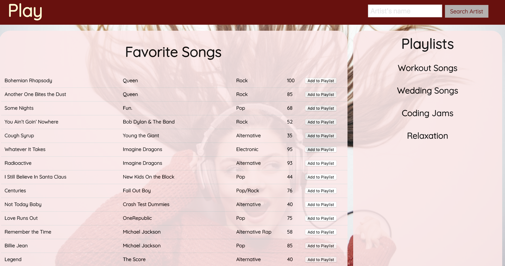
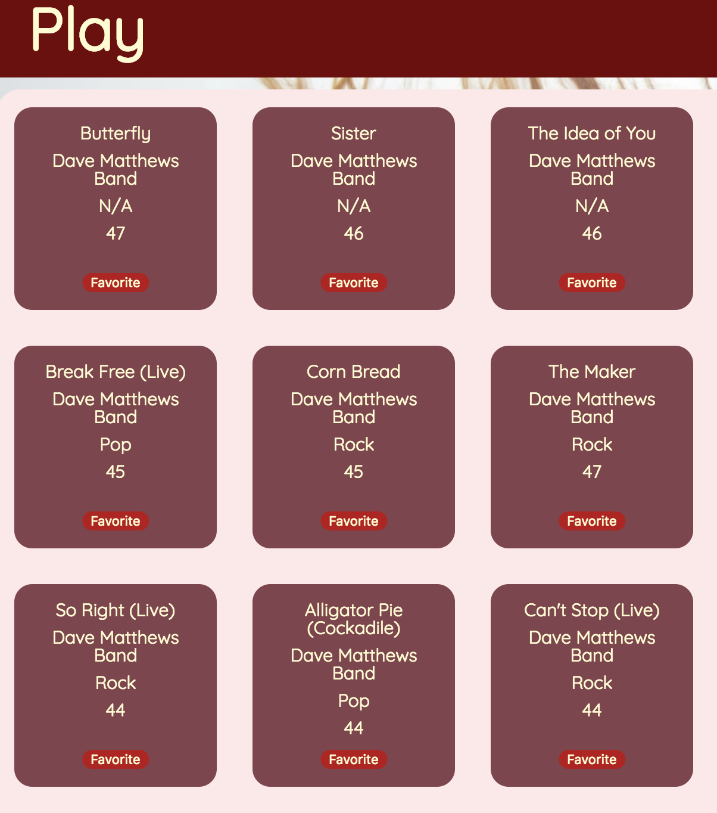
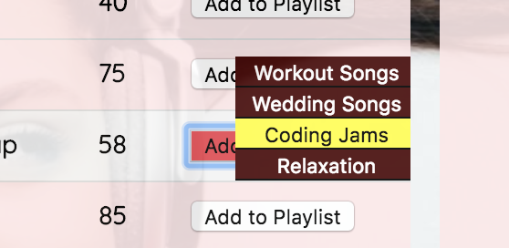
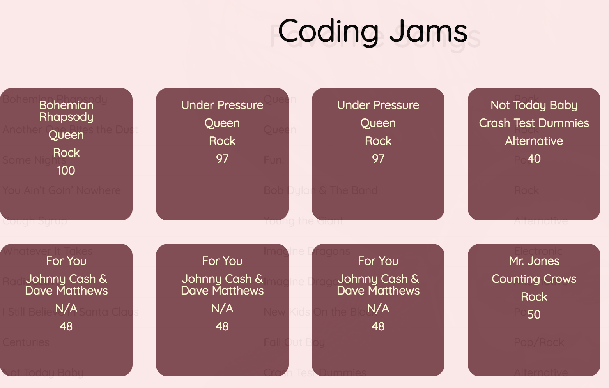

# Play (Front End)

Visit the deployed site here: https://play-project.herokuapp.com/

This project consumes API endpoints created from our back end app. You can visit this at: https://github.com/andrewetobin/play_be

### Learning Objectives

Our goals was to build a personal playlist and song manager. It's currently only intended for one user to keep track of their songs. The user can search an artist from the Nav Bar and a list of songs (retrieved from the MusixMatch API) will be displayed. A user can click on 'favorite' to add that song to their list of favorites. From that favorite, a user can add a song to a specific playlist by clicking 'Add to Playlist'. By clicking on a playlist, the songs within that playlist will be displayed.

**Areas of Focus**
- Using fetch to make API calls
- ES6 and JQuery
- Webpack
- Hosting Webpack app on Heroku
- Pair Programming
- Agile Workflow

### Running Code
**In order to clone down and run this code locally, you will need an API Key to MusixMatch | https://developer.musixmatch.com/**
(This API requires you install a CORS extension to your browser. If you're using Chrome, you can retrieve the extension here: https://chrome.google.com/webstore/detail/allow-control-allow-origi/nlfbmbojpeacfghkpbjhddihlkkiljbi?hl=en)

- Fork or clone this response
- Run `npm install`
- Run `npm run dev` to start up server on your local machine

### Features

**Landing Page**
On first arrival to the site, the user will see their favorited songs and their playlists.

**Artist Search**
By entering an artist into the search field, a list of their songs are generated.

**Add to Playlist**
When clicking on Add to Playlist, it will list the current playlists' titles.

**Playlist Songs**
Clicking on a Playlist title will display the songs in that playlist.

### Run-through

### Future Iterations

- Add ability to add new playlists.
- Add ability to delete songs and playlists.
- Login functionality to support multiple users and accounts.
- Song information when a user clicks on a specific song.

###### Core Contributors
  - Kathleen Yruegas | github.com/kathleenyruegas
  - Andrew Tobin | github.com/andrewetobin
